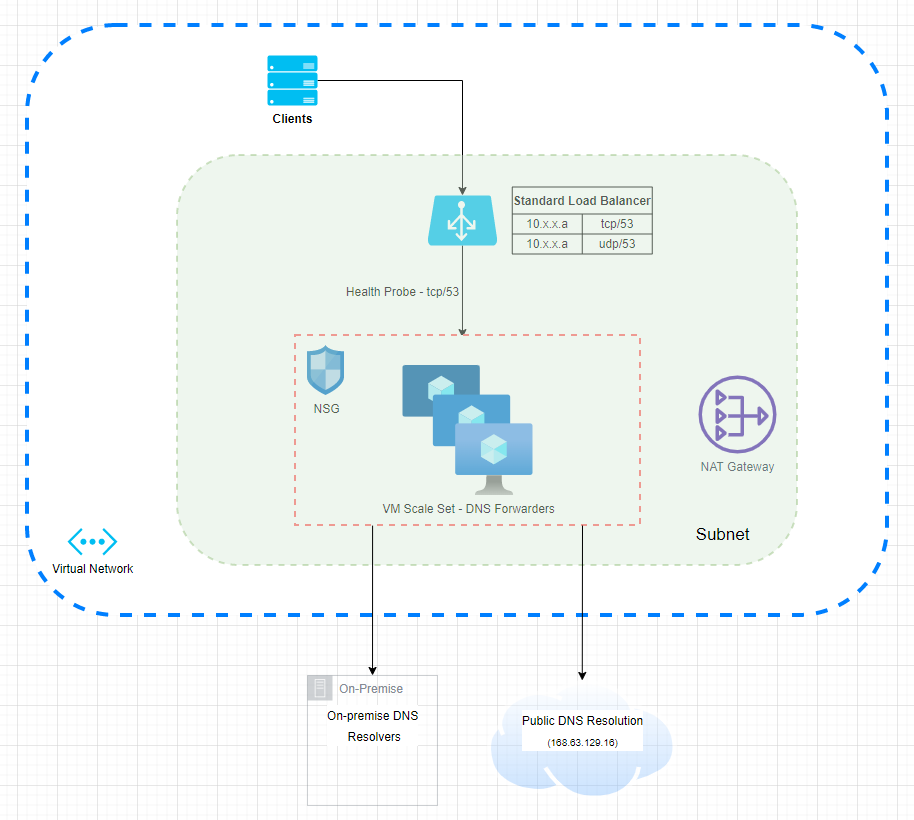

# Azure DNS Forwarding within your ExpressRoute Connected VNet

When your VNet is connected to your 'on-prem' company/corporate network via an ExpressRoute circuit and you need to resolve private DNS names as well as public DNS names, you need a DNS forwarding solution. 

This Terraform module stands up a Virtual Machine Scale Set (VMSS) with two VM's running `bind` which will appropriately forward your DNS queries to either your private DNS servers or Azure's public DNS resolution service. These VMSS is fronted with an Azure Load Balancer that has two front-end static IP's which you will then configure in your VNet as Custom DNS servers. Once this is done, any existing VM's (provided you reboot them), or new VM's will use these VIP's as their DNS servers. Below is a diagram of what this TF module will build:



### Terraform State & Source Code Storage

It is at the discretion of the end-user of this Terraform module to determine how they wish to store and maintain the resulting Terraform `state`, as well as their source code that calls this module.

For the `admin_username`, `admin_password` OR `public_key`, `public_key_username` information that must be provided when calling this TF module, these bits of data should not be stored in any source code repository in plain-text. It recommended that a tool such as [SOPS](https://github.com/mozilla/sops) be used to encrypt this data.

### Example

```hcl
module "dns-forwarding" {
  source                   = "disney/azure-dns-forwarding"
  version                  = "<always_specify_version_number>"
  lb_front_end_ip_subnet   = "/subscriptions/<subid>/resourceGroups/subnet-test/providers/Microsoft.Network/virtualNetworks/vnetname/subnets/subnet1"
  load_balancer_static_ip  = "10.x.x.x" 
  vmss_subnet_id           = "/subscriptions/<subid>/resourceGroups/subnet-test/providers/Microsoft.Network/virtualNetworks/vnetname/subnets/subnet1"
  vnet_cidr                = "10.x.x.x/YY"
  vnet_location            = "westus"
  subnet_has_nat_gateway   = <true/false>

  # Zones to forward to private DNS resolvers
  dns_zones = {
    "on-prem-zone1.com" = ["10.x.x.x", "10.y.y.y.y"]
    "on-prem-zone2.com" = ["10.x.x.x", "10.z.z.z.z"]
  }

  # Authentication for VMSS Virtual Machines
  # Either admin_username & admin_password must be used OR public_key & public_key_username must be used
  # The values of these two variables should be encrypted; please see note about use of SOPS above
  admin_username = "<username>"
  admin_password = "<password>"
}
```

## Post Deployment Steps

After you have deployed this module and the `var.load_balancer_static_ip` is servicing DNS requests, you must configure both of these static IP's as Custom DNS servers in your VNet configuration which is explained in this [article](https://docs.microsoft.com/en-us/azure/virtual-network/manage-virtual-network#change-dns-servers). In `Step 4`, add the `var.load_balancer_static_ip` as a Custom DNS server to your VNet. Please then refer to the remaining steps, 5 and 6.

## Performance Metrics

Performance of the two DNS forwarders via the Azure LB was measured with 50,000 DNS queries of different names for which the DNS forwarders are authoritative, and 50,000 DNS queries of the same name for which the DNS forwarders are authoritative. The [dnsperf](https://github.com/DNS-OARC/dnsperf) tool was used.

The test run with 50,000 different DNS names is meant to show the average performance of the particular size of VM that was used. The test run with 50,000 of the same DNS name is meant to show the "maximum potenantial throughput" of the size of VM that was used.

### Standard_D2_v5 Azure VM

#### 50,000 DNS Queries with Different Names
```
user@bastion01:~/sample-query-data# time dnsperf -s 10.142.20.73 -c 5 -T 5 -d testdomainname-50000-lines.txt
DNS Performance Testing Tool
Version 2.9.0

[Status] Command line: dnsperf -s 10.142.20.73 -c 5 -T 5 -d testdomainname-50000-lines.txt
[Status] Sending queries (to 10.142.20.73:53)
[Status] Started at: Mon Feb 28 19:50:37 2022
[Status] Stopping after 1 run through file
[Status] Testing complete (end of file)

Statistics:

  Queries sent:         50000
  Queries completed:    50000 (100.00%)
  Queries lost:         0 (0.00%)

  Response codes:       NOERROR 50000 (100.00%)
  Average packet size:  request 55, response 71
  Run time (s):         9.735678
  Queries per second:   5135.749149

  Average Latency (s):  0.018821 (min 0.012951, max 1.235112)
  Latency StdDev (s):   0.027804


real    0m9.748s
user    0m0.313s
sys     0m0.796s
```

#### 50,000 DNS Queries with Same Name
```
user@bastion01:~/sample-query-data# time dnsperf -s 10.142.20.73 -c 5 -T 5 -d identical-testdomainname-50000-lines.txt
DNS Performance Testing Tool
Version 2.9.0

[Status] Command line: dnsperf -s 10.142.20.73 -c 5 -T 5 -d identical-testdomainname-50000-lines.txt
[Status] Sending queries (to 10.142.20.73:53)
[Status] Started at: Mon Feb 28 19:56:50 2022
[Status] Stopping after 1 run through file
[Timeout] Query timed out: msg id 8284
[Timeout] Query timed out: msg id 8285
[Status] Testing complete (end of file)

Statistics:

  Queries sent:         50000
  Queries completed:    49998 (100.00%)
  Queries lost:         2 (0.00%)

  Response codes:       NOERROR 49998 (100.00%)
  Average packet size:  request 49, response 65
  Run time (s):         0.545993
  Queries per second:   91572.602579

  Average Latency (s):  0.000901 (min 0.000284, max 0.010960)
  Latency StdDev (s):   0.000854


real    0m5.460s
user    0m2.477s
sys     0m2.785s
```

### Standard_D8_v5 Azure VM

#### 50,000 DNS Queries with Different Names
```
root@bidevlbastion01:~/sample-query-data# time dnsperf -s 10.142.20.73 -c 5 -T 5 -d testdomainname-50000-lines.txt
DNS Performance Testing Tool
Version 2.9.0

[Status] Command line: dnsperf -s 10.142.20.73 -c 5 -T 5 -d testdomainname-50000-lines.txt
[Status] Sending queries (to 10.142.20.73:53)
[Status] Started at: Mon Feb 28 20:32:07 2022
[Status] Stopping after 1 run through file
[Status] Testing complete (end of file)

Statistics:

  Queries sent:         50000
  Queries completed:    50000 (100.00%)
  Queries lost:         0 (0.00%)

  Response codes:       NOERROR 50000 (100.00%)
  Average packet size:  request 55, response 71
  Run time (s):         9.039720
  Queries per second:   5531.144770

  Average Latency (s):  0.017878 (min 0.012870, max 1.238351)
  Latency StdDev (s):   0.023269


real    0m9.051s
user    0m0.297s
sys     0m0.728s
```

#### 50,000 DNS Queries with Same Name
```
root@bidevlbastion01:~/sample-query-data# time dnsperf -s 10.142.20.73 -c 5 -T 5 -d identical-testdomainname-50000-lines.txt
DNS Performance Testing Tool
Version 2.9.0

[Status] Command line: dnsperf -s 10.142.20.73 -c 5 -T 5 -d identical-testdomainname-50000-lines.txt
[Status] Sending queries (to 10.142.20.73:53)
[Status] Started at: Mon Feb 28 20:33:07 2022
[Status] Stopping after 1 run through file
[Status] Testing complete (end of file)

Statistics:

  Queries sent:         48500
  Queries completed:    48500 (100.00%)
  Queries lost:         0 (0.00%)

  Response codes:       NOERROR 48500 (100.00%)
  Average packet size:  request 49, response 65
  Run time (s):         0.475324
  Queries per second:   102035.664094

  Average Latency (s):  0.000789 (min 0.000290, max 0.009938)
  Latency StdDev (s):   0.000718


real    0m0.496s
user    0m0.099s
sys     0m0.274s
```

## Requirements

| Name | Version |
|------|---------|
| terraform | >= 1.1.3 |
| azurerm | >= 2.94 |
| cloudinit | >= 2.20 |

## Providers

| Name | Version |
|------|---------|
| azurerm | 2.94.0 |
| cloudinit | 2.20 |


## Resources

| Name | Type |
|------|------|
| [azurerm_application_security_group.dns_forwarding](https://registry.terraform.io/providers/hashicorp/azurerm/latest/docs/resources/application_security_group) | resource |
| [azurerm_lb.dns_forwarding](https://registry.terraform.io/providers/hashicorp/azurerm/latest/docs/resources/lb) | resource |
| [azurerm_lb_backend_address_pool.dns_forwarding](https://registry.terraform.io/providers/hashicorp/azurerm/latest/docs/resources/lb_backend_address_pool) | resource |
| [azurerm_lb_probe.dns_forwarding](https://registry.terraform.io/providers/hashicorp/azurerm/latest/docs/resources/lb_probe) | resource |
| [azurerm_lb_rule.dns_forwarding_tcp](https://registry.terraform.io/providers/hashicorp/azurerm/latest/docs/resources/lb_rule) | resource |
| [azurerm_lb_rule.dns_forwarding_udp](https://registry.terraform.io/providers/hashicorp/azurerm/latest/docs/resources/lb_rule) | resource |
| [azurerm_linux_virtual_machine_scale_set.dns_forwarding](https://registry.terraform.io/providers/hashicorp/azurerm/latest/docs/resources/linux_virtual_machine_scale_set) | resource |
| [azurerm_nat_gateway.dns_forwarding](https://registry.terraform.io/providers/hashicorp/azurerm/latest/docs/resources/nat_gateway) | resource |
| [azurerm_nat_gateway_public_ip_association.dns_forwarding](https://registry.terraform.io/providers/hashicorp/azurerm/latest/docs/resources/nat_gateway_public_ip_association) | resource |
| [azurerm_network_security_group.dns_forwarding](https://registry.terraform.io/providers/hashicorp/azurerm/latest/docs/resources/network_security_group) | resource |
| [azurerm_network_security_rule.dns_forwarding](https://registry.terraform.io/providers/hashicorp/azurerm/latest/docs/resources/network_security_rule) | resource |
| [azurerm_public_ip.dns_forwarding](https://registry.terraform.io/providers/hashicorp/azurerm/latest/docs/resources/public_ip) | resource |
| [azurerm_resource_group.dns_forwarding](https://registry.terraform.io/providers/hashicorp/azurerm/latest/docs/resources/resource_group) | resource |
| [azurerm_subnet_nat_gateway_association.dns_forwarding](https://registry.terraform.io/providers/hashicorp/azurerm/latest/docs/resources/subnet_nat_gateway_association) | resource |
| [azurerm_shared_image_version.dmi_from_gallery](https://registry.terraform.io/providers/hashicorp/azurerm/latest/docs/data-sources/shared_image_version) | data source |

## Inputs

| Name | Description | Type | Default | Required |
|------|-------------|------|---------|:--------:|
| dns\_zones | List of DNS Zones who's requests should be forwarded to private, on-prem DNS servers | `object` | n/a | yes |
| lb\_front\_end\_ip\_subnet | Subnet ID of the Load Balancer front end IP addresses | `string` | n/a | yes |
| load\_balancer\_static\_ip | A static IP that will be the front end IP of the load balancer | `string` | n/a | yes |
| subnet\_has\_nat\_gateway | The subnet where this module is to be deployed already has a NAT Gateway (required for the VMSS VM's to get access to the Internet) | `bool` | n/a | yes |
| vmss\_subnet\_id | The ID of the subnet where you want to place the Virtual Machine Scale Set | `string` | n/a | yes |
| vnet\_cidr | The CIDR notation of the VNet where you are deploying DNS forwarding, such as 10.100.34.0/24 | `string` | n/a | yes |
| vnet\_location | The location, such as 'westus' of the Virtual Network where you want DNS Forwarding services | `string` | n/a | yes |
| additional\_cloud\_config\_content | Optional additional cloud-config file content to be merged in with main cloud-config. | `string` | `null` | no |
| additional\_cloud\_config\_merge\_type | Optional value for the `X-Merge-Type` header to control cloud-init merging behavior when `additional_cloud_config_content` is provided. See https://cloudinit.readthedocs.io/en/latest/topics/merging.html for available options. | `string` | `null` | no |
| admin\_password | The admin password of the admin\_username for the VM's in the VMSS. Either admin\_username & admin\_password must be used OR public\_key & public\_key\_username must be used | `string` | `null` | no |
| admin\_username | The username of the local administrator on each Virtual Machine Scale Set instance | `string` | `null` | no |
| automatic\_instance\_repair | Should the VMSS automatically repair unhealthy hosts | `bool` | `true` | no |
| common\_tags | n/a | `map(string)` | ```{ "managed_by": "terraform", "project": "Azure DNS forwarding" }``` | no |
| custom\_base\_cloudinit | Gives users of this module the option of replacing the entire defult DNS configuration, found in local.base_cloudinit, with their own config. | `string` | `null` | no |
| custom\_nsg\_rules | Gives users of this module the option of supplying their own NSG rules. | `object` | `null` | no |
| custom\_source\_image | Use a custom specified image for the VM's in the Scale Set, as opposed to the default image which is the latest Ubuntu 20 image from the DMI image gallery | `bool` | `false` | no |
| custom\_tags | Map of tags you would like to have added to the common\_tags to tag all applicable resources | `map(string)` | `{}` | no |
| dgn\_cidrs | List of DGN CIDR's to permit inbound to ssh into the backend VM's | `list(string)` | ```[ "10.0.0.0/8" ]``` | no |
| dnssec\_enable | Configure `dnssec-enable` setting in /etc/bind/named.conf.options | `string`| `"yes"` | no |
| dnssec\_validation | Configure `dnssec-validation` setting in /etc/bind/named.conf.options | `string` | `"yes"` | no |
| grace\_period\_instance\_repair | Amount of time (in minutes, between 30 and 90, defaults to 30 minutes) for which automatic repairs will be delayed. The grace period starts right after the VM is found unhealthy. The time duration should be specified in ISO 8601 format. | `string` | `"PT30M"` | no |
| image\_gallery\_gallery\_name | Name of image gallery where image comes from | `string` | `"dmi"` | no |
| image\_gallery\_image\_name | Name of the image from the gallery | `string` | `"base-dtss-ubuntu-20"` | no |
| image\_gallery\_name | Name of the image. 'latest' pulls the latest image | `string` | `"latest"` | no |
| image\_gallery\_resource\_group\_name | Name of the resource group where the image gallery resides | `string` | `"dmi"` | no |
| os\_disk\_caching | The Type of Caching which should be used for the Internal OS Disk. Possible values are None, ReadOnly and ReadWrite | `string` | `"None"` | no |
| os\_disk\_size\_gb | The Size of the Internal OS Disk in GB, if you wish to vary from the size used in the image this Virtual Machine Scale Set is sourced from | `number` | `40` | no |
| os\_disk\_storage\_account\_type | The Type of Storage Account which should back this the Internal OS Disk. Possible values include Standard\_LRS, StandardSSD\_LRS and Premium\_LRS | `string` | `"Standard_LRS"` | no |
| permitted\_to\_query\_dns\_forwarders | List of CIDR blocks that are permitted to query the DNS forwarders via the `allowed-query` config item in the named.conf.options file | `list(string)` | `[10.0.0.0/8]` | no |
| public\_key | The Public Key which should be used for authentication, which needs to be at least 2048-bit and in ssh-rsa format. Either admin\_username & admin\_password must be used OR public\_key & public\_key\_username must be used | `string` | `null` | no |
| public\_key\_username | The Username for which this Public SSH Key should be configured | `string` | `null` | no |
| quantity\_of\_instances | The number of Virtual Machines in the Scale Set | `number` | `2` | no |
| querylog | Querylog enabled in named.conf.options | `string` | `"false"` | no |
| resource\_group\_name | n/a | `string` | `"rg-dns-forwarding"` | no |
| user\_data\_script | Optional cloud-config user-data script. See https://cloudinit.readthedocs.io/en/latest/topics/format.html?highlight=shell#user-data-script for more info. | `string` | `null` | no |
| vm\_sku | The SKU of the VM to run the DNS forwarding services | `string` | `"Standard_D2_v5"` | no |
| vmss\_image\_offer | Must be specified if var.custom\_source\_image is true. Specifies the offer of the image used to create the virtual machines | `string` | `null` | no |
| vmss\_image\_publisher | Must be specified if var.custom\_source\_image is true. Specifies the publisher of the image used to create the virtual machines | `string` | `null` | no |
| vmss\_image\_sku | Must be specified if var.custom\_source\_image is true. Specifies the SKU of the image used to create the virtual machines | `string` | `null` | no |
| vmss\_image\_version | Must be specified if var.custom\_source\_image is true. Specifies the version of the image used to create the virtual machines. | `string` | `null` | no |
| vmss\_name | Virtual Machine Scale Set (VMSS) name | `string` | `"vmss-dns-forwarding"` | no |

## Outputs

No outputs.

### Author

Mitchell L. Cooper

### Contributors

- Justice M. London
- James Philpott
